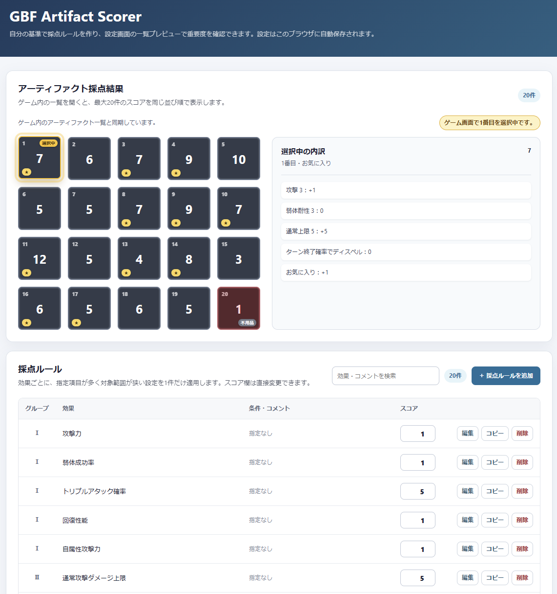
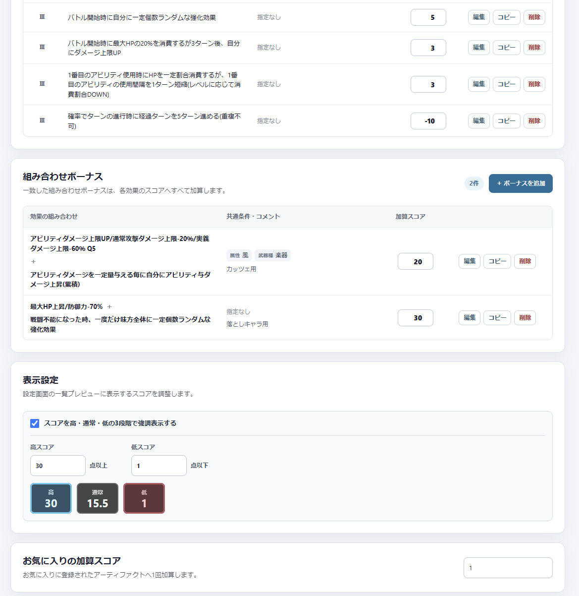

<!-- deno-fmt-ignore-file -->

# GBF Artifact Scorer

グランブルーファンタジーのアーティファクトを自分の基準で採点し、拡張機能の設定画面にスコアを表示する非公式のChrome拡張機能です。

効果・クオリティ・属性・武器種に応じた採点ルールを作成し、残したいアーティファクトを見分けやすくします。

## 動作イメージ

### 設定画面

拡張機能のアイコンから設定画面を開き、効果ごとの採点ルールや組み合わせボーナスを編集できます。
ゲーム内のアーティファクト一覧を開くと、最大20件の採点結果を5列×4行の一覧プレビューへ同じ並び順で表示します。
ゲーム画面で選択中の位置を強調し、お気に入りと不用品の状態も表示します。





本拡張機能は、ゲーム画面のDOMへスコア表示用の要素・属性・スタイルを追加しません。

## 主な機能

- 設定画面の一覧プレビューに最大20件の合計スコアを表示
- ゲーム画面で選択中のアーティファクトの位置を強調
- お気に入りと不用品の状態を一覧プレビューへ反映
- 選択中のアーティファクトのスコア内訳を一覧右側へ表示
- お気に入りに対する任意の加算スコア
- 指定したしきい値による高・通常・低の3段階表示
- 効果とクオリティごとのスコア設定
- `Q2以上`・`Q4以下`などのクオリティ範囲を指定したスコア設定
- 属性・武器種を指定した採点ルール
- 2つの効果が揃ったときに加算する組み合わせボーナス
- 負のスコアへの対応
- 一覧から採点ルールのスコアを直接編集
- 採点ルールと組み合わせボーナスを入力済みの追加フォームへコピー
- 一覧プレビューでのスコア内訳表示
- 同梱された標準設定への復元
- 採点ルールの全削除
- 設定JSONの書き出しと読み込み
- Chromeの表示言語に応じた日本語・英語の設定画面

## 採点方法

各効果には、一致する採点ルールのうち、クオリティ・属性・武器種の指定項目数が最も多い1件を適用します。
指定項目数が同じ場合は対象となるクオリティ・属性・武器種の数が少ないルールを優先し、それも同じ場合は設定データ内で先に並ぶルールを適用します。

クオリティが1種類で固定されている効果は、クオリティ条件を指定せず一律のルールとして保存します。

クオリティ条件には単一のクオリティに加えて、`Q2以上`・`Q4以下`などの範囲を指定できます。
同じ属性・武器種条件では、単一指定、対象クオリティ数が少ない範囲、対象クオリティ数が多い範囲、「全て」の順で優先します。
対象クオリティ数と他の条件が同じ範囲が重なった場合は、設定データ内で先に並ぶルールを適用します。
組み合わせボーナスのクオリティ条件は、従来どおり「全て」または単一指定です。

初回利用時は、同梱された標準設定を適用します。
標準設定は自由に編集でき、設定画面からいつでも元に戻せます。

ユーザーが作成した採点ルールに一致しない場合は「ルール未設定時のスコア」を使用します。
初期値は0点です。
「採点ルールを全て削除」を選ぶと、表示設定を残したまま全効果を0点にできます。

組み合わせボーナスは通常の効果スコアとは別に判定し、一致したものをすべて合計へ加算します。

「お気に入りの加算スコア」を設定すると、お気に入りに登録されたアーティファクトの合計へ指定値を1回加算します。初期値は0点です。

3段階表示を有効にすると、一覧プレビュー上で高スコアは青色、低スコアは赤色で強調し、その間を通常表示にします。
高スコア・低スコアのしきい値は表示設定から変更できます。

## インストール

### Chromeウェブストアからインストール

公開後は[Chromeウェブストア](https://chromewebstore.google.com/detail/amnkcjbhhippgcaieemghdcomdklfjnh)からインストールできます。

### 開発版を読み込む

開発中のバージョンを確認する場合は、GitHubから取得したソースコードを未パッケージ拡張機能として読み込みます。

1. このリポジトリをダウンロードして展開するか、`git clone`します。
2. Chromeで`chrome://extensions`を開きます。
3. 「デベロッパー モード」を有効にします。
4. 「パッケージ化されていない拡張機能を読み込む」を選択します。
5. このリポジトリのルートディレクトリを指定します。

更新後は拡張機能を再読み込みしてください。
通信監視や一覧同期の処理を変更した場合は、開いているゲーム画面も再読み込みします。

## 使い方

1. Chromeのツールバーから拡張機能のアイコンをクリックします。
2. 「採点ルールを追加」から効果とスコアを設定します。
3. 必要に応じてクオリティ・属性・武器種・コメントを指定します。
4. ゲーム内でアーティファクト一覧を開きます。
5. 設定画面へ戻ると、ゲーム内と同じ位置に合計スコアが表示されます。
6. ゲーム画面でアーティファクトをクリックすると、設定画面の対応する枠が強調されます。

必要に応じて表示設定から3段階表示を有効にし、高スコアと低スコアのしきい値を指定します。お気に入りへ一律で加点する場合は「お気に入りの加算スコア」を設定します。

条件を指定しなかった項目は「全て」として扱います。
採点ルールのスコア欄は一覧から直接変更できます。

## 設定の保存

設定は`chrome.storage.local`を使用して、そのブラウザープロファイル内に保存します。
Googleアカウントを利用したブラウザー間同期は行いません。

別の環境へ移す場合は、設定画面の「JSONを書き出す」と「JSONを読み込む」を使用してください。

JSONへ書き出す効果名・属性・武器種は、現在のChromeの表示言語に合わせて日本語または英語になります。
読み込み時は日本語名と英語名の両方に対応しており、異なる表示言語で書き出した設定も利用できます。
拡張機能内部では既存設定との互換性を保つため、従来の日本語名を共通の識別名として保存します。

クオリティの単一指定は従来どおり`quality`、以上・以下の範囲指定はそれぞれ`qualityMin`・`qualityMax`として書き出します。

「標準設定に戻す」は、現在の採点ルールを同梱された`default-user-config.json`の内容で置き換えます。一覧プレビューの表示設定は保持します。
「採点ルールを全て削除」は、効果ごとのルールと組み合わせボーナスを削除します。

## 通信について

この拡張機能からゲームサーバーや外部サービスへの追加通信は行いません。

ゲーム画面ですでに行われているアーティファクト一覧の通信結果を監視し、端末内で計算したスコアを設定画面へ送ります。
ゲーム画面のDOMは、一覧の並び順・属性・武器種・お気に入り・不用品の状態・選択位置を確認する目的で読み取るだけで、要素・属性・スタイルの追加や変更は行いません。
ユーザーの採点ルールや閲覧情報を外部へ送信する処理はありません。

## サポートとプライバシー

問題の報告は[GitHub Issues](https://github.com/eggpan/gbf-artifact-scorer/issues)からお願いします。
情報の取り扱いについては[プライバシーポリシー](PRIVACY.md)をご確認ください。

## 開発

ランタイムと開発ツールの管理には[mise](https://mise.jdx.dev/)を使用します。
Denoのバージョンは`mise.toml`で指定しています。

```sh
mise install
deno fmt
deno lint
deno test
```

ビルド処理やnpm依存関係はありません。

### 主な構成

```text
core/
  localization-core.js       # 効果名・設定JSONのローカライズ
  score-config-core.js       # 設定の検証・正規化
  score-config-editor-core.js # 設定画面のルール編集・並び替え
  artifact-score-core.js     # 採点・ツールチップ整形
  artifact-list-core.js      # 一覧応答の検証・DOMとの対応付け
tests/
  score-config-core.test.js
  score-config-editor-core.test.js
  artifact-score-core.test.js
  artifact-list-core.test.js
  effects-master.test.js
  default-user-config.test.js
  manifest.test.js
content.js                   # ゲーム画面の一覧・選択状態の読み取りと採点
artifact-list-xhr-bridge.js  # ゲームのアーティファクト一覧通信の監視
options.html / options.css / options.js # 設定画面
options-locales.js           # 設定画面の日本語・英語表示
effects-master.json          # 効果マスタ
default-user-config.json     # 初回利用時の標準設定
```

DOM操作やChrome API連携は実際のブラウザーで確認し、それらに依存しない設定・採点ロジックはDenoの単体テストで検証します。

## 注意事項

本ツールは非公式のファンメイドツールであり、株式会社Cygamesとは関係ありません。
ゲーム画面およびゲーム内素材の権利は株式会社Cygamesに帰属します。
ゲーム側の仕様やHTML構造の変更により、動作しなくなる可能性があります。
